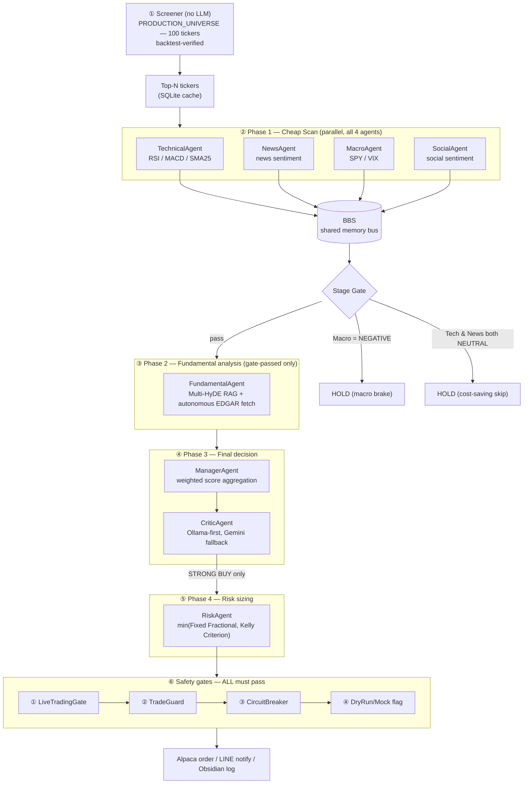
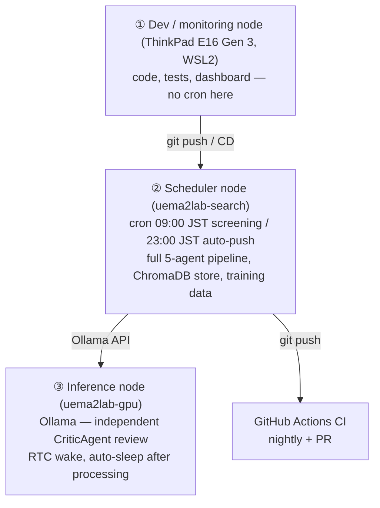

# ai-investor-bot — Autonomous Multi-Agent Swing-Trading System

> A multi-agent, consensus-based autonomous trading system for S&P 500 equities.
> Stage-gate pipeline · Multi-HyDE RAG · Alpaca auto-execution · Obsidian knowledge-base integration.

> **Translation status**: this is an English port of [`README.md`](README.md) (the source of truth, kept in Japanese).
> Sections 1–4 (architecture, pipeline, agents, safety) are fully translated. Sections 5–16 are condensed —
> see the inline `<!-- TODO -->` markers for what still needs full translation. Numbers and thresholds are
> copied verbatim from the Japanese source; if the two ever disagree, `README.md` wins.

---

## Table of Contents

1. [System Architecture](#system-architecture)
2. [Phase 1–4 Pipeline Detail](#phase-14-pipeline-detail)
3. [Agent Roster](#agent-roster)
4. [Safety Layers (Defense in Depth)](#safety-layers-defense-in-depth)
5. [Day-to-Day Operations](#day-to-day-operations)
6. [monitor.py — Terminal TUI](#monitorpy--terminal-tui)
7. [dashboard.py — Streamlit Web UI](#dashboardpy--streamlit-web-ui)
8. [Enabling Live Trading](#enabling-live-trading)
9. [Setup](#setup)
10. [Command Reference](#command-reference)
11. [Knowledge Base / Wiki](#knowledge-base--wiki)
12. [Infrastructure](#infrastructure)
13. [Tech Stack](#tech-stack)
14. [Directory Structure](#directory-structure)
15. [Engineering Highlights — Data-Driven Design Decisions](#engineering-highlights--data-driven-design-decisions)
16. [Roadmap](#roadmap)

---

## System Architecture



### STRONG BUY conditions (all must hold)

| Condition | Detail |
|---|---|
| Weighted score ≥ 0.60 | FA×0.40 / Technical×0.20 / Macro×0.20 / News×0.10 / Social×0.10 |
| Fundamental > 0 | Required — zero or negative blocks the order |
| Technical ≥ 0 | Negative blocks the order |
| News ≥ 0 | Negative blocks the order |
| Macro ≥ 0 | A `NEGATIVE` macro reading forces HOLD regardless of the rest |

---

## Phase 1–4 Pipeline Detail

### Phase 1 — Cheap Scan (parallel)

Four agents generate signals independently while minimizing LLM calls. Every agent writes its result to the BBS (Bulletin Board System: a shared JSON dict).

| Agent | What it does | BBS key |
|---|---|---|
| TechnicalAgent | Computes RSI, MACD, SMA25 deviation, volume ratio → LLM evaluation | `technical_analysis` |
| NewsAgent | Fetches news from Alpha Vantage / Finnhub → sentiment classification | `news_analysis` |
| MacroAgent | Evaluates macro conditions via SPY / VIX | `macro_analysis` |
| SocialAgent | Social sentiment + hype_score | `social_analysis` |

**Stage Gate:**
- `MacroAgent` returns **NEGATIVE** → all tickers go to immediate HOLD (macro-downturn brake)
- `TechnicalAgent` and `NewsAgent` are **both NEUTRAL** → cost-saving HOLD, Fundamental phase is skipped

### Phase 2 — Fundamental Analysis

Runs only for gate-passed tickers, using **Multi-HyDE RAG**:

```
User query
  └→ LLM generates 3 hypothetical documents ("what the actual filing would likely say")
       └→ ChromaDB search over [query + 3 hypotheses]
            └→ top chunks injected as context → LLM produces the final answer
```

Plus **autonomous EDGAR retrieval**: if quarterly data is more than 7 days stale, the system
auto-downloads the latest 10-Q/10-K from SEC EDGAR and refreshes ChromaDB.

### Phase 3 — Final Decision

1. **ManagerAgent** — aggregates BBS data into a weighted score. Applies a penalty when social hype
   (`hype_score ≥ 0.7`) is detected without technical/fundamental backing.
2. **CriticAgent** — an independent local-LLM (Ollama) review with `OVERRIDE` power (can force HOLD or force BUY).
3. **AuditAgent** — evaluates historical win rates per agent; agents with win rate < 40% over ≥ 20 trades
   are set to `SUSPENDED` (weight zeroed, but still shadow-tracked).

### Phase 4 — Risk Sizing

Runs only after a STRONG BUY is confirmed:
- **Fixed Fractional**: position size derived from 2% account risk.
- **Kelly Criterion**: position size derived from expected win rate / payoff ratio.
- The system takes the **smaller** of the two (conservative sizing).
- Stop-loss: ATR × 2 below entry.
- Take-profit target: ATR × 4 above entry (1:2 risk/reward).

---

## Agent Roster

| Agent | Role | Location |
|---|---|---|
| **TechnicalAgent** | RSI / MACD / SMA25 deviation / volume ratio → LLM evaluation | `engine/agent_wrappers.py` |
| **NewsAgent** | News retrieval and sentiment analysis | `engine/agent_wrappers.py` |
| **MacroAgent** | SPY/VIX macro evaluation (brake on NEGATIVE) | `engine/agent_wrappers.py` |
| **SocialAgent** | Social sentiment + hype penalty | `engine/agent_wrappers.py` |
| **FundamentalAgent** | Multi-HyDE RAG + autonomous EDGAR retrieval | `agents/fundamental_agent.py` |
| **ManagerAgent** | BBS aggregation, weighted scoring, final decision | `engine/agent_wrappers.py` |
| **CriticAgent** | Independent Ollama review, OVERRIDE capability | `tools/critic_agent.py` |
| **RiskAgent** | Fixed Fractional + Kelly Criterion sizing | `engine/agent_wrappers.py` |
| **ExitAgent** | Open-position monitoring (+10% take-profit / -5% stop-loss / THESIS_BROKEN) | `agents/exit_agent.py` |
| **AuditAgent** | Per-agent win-rate evaluation, SUSPENDED management | `agents/audit_agent.py` |

### AuditAgent — meta-evaluation loop

| Parameter | Value |
|---|---|
| Minimum trades before evaluation | 20 (grace period below this) |
| SUSPENDED threshold | win rate < 40% |
| Reinstatement threshold | win rate ≥ 50% |
| Behavior while SUSPENDED | weight = 0 (muted), still logged in shadow mode |

---

## Safety Layers (Defense in Depth)

The system enforces **four independent safety layers**. Any single failure blocks the order.

```
Order flow
  ├─① LiveTradingGate (two-factor live-trading consent)
  │    ALPACA_PAPER_TRADING=false AND consent file valid AND not expired (24h)
  ├─② TradeGuard (order guardrails)
  │    daily BUY cap · concurrent-position cap · per-position size cap
  ├─③ CircuitBreaker (automatic drawdown stop)
  │    daily -5% → SOFT_TRIP / peak-to-trough -10% → HARD_TRIP
  └─④ DryRun/Mock flags (test mode)
```

### ① LiveTradingGate

> ⚠️ **Fully automated since 2026-06-03 (`d6f7bd1`).** The table below reflects actual current behavior.
> The original "24h manual consent + wizard confirmation" design was replaced because it was incompatible
> with unattended cron operation — the safety anchor shifted from a daily human re-confirmation to the
> presence of a live API key in `.env` itself (which is still a deliberate human action, just a one-time one).
> Full rationale and the resulting risk trade-off: [`docs/SAFETY.md`](docs/SAFETY.md).

| Condition | Detail |
|---|---|
| Env var | `ALPACA_PAPER_TRADING=false` required |
| API key | If `APCA_API_KEY_ID` is set in `.env`, live trading is **auto-approved** — `check()` no longer reads any consent file or checks a 24h expiry |

The `--enable-live` / `--disable-live` wizard still exists for backward compatibility but is **not**
consulted by the actual order-gating logic:
```bash
python main.py --enable-live   # legacy wizard — not used by check()
python main.py --disable-live  # deletes the legacy consent file — not used by check()
```

### ② TradeGuard

Default configuration (overridable via `data/trade_guards.json`):

| Guardrail | Current value | Note |
|---|---|---|
| Daily BUY cap | 3/day | unchanged |
| Concurrent open positions | 5 tickers | unchanged |
| Max position size per ticker | **1.0 (effectively no cap)** | relaxed from 0.20 (20%) on 2026-06-03 — see [`docs/SAFETY.md`](docs/SAFETY.md) |

### ③ CircuitBreaker

| Trip | Condition | Effect | Reset |
|---|---|---|---|
| SOFT_TRIP | daily drawdown ≥ -5% | blocks new BUYs for the day | automatic next day |
| HARD_TRIP | peak-to-trough drawdown ≥ -10% | blocks all BUYs | `manual_reset(level="hard")` only |

Check status:
```python
from tools.circuit_breaker import CircuitBreaker
cb = CircuitBreaker()
print(cb.status)  # "OPEN" | "SOFT_TRIP" | "HARD_TRIP"
```

Manual HARD_TRIP reset (emergency only):
```python
cb.manual_reset(level="hard")
```

---

## Day-to-Day Operations

<!-- TODO: full translation. Condensed summary below. -->

- **Paper trading (recommended)**: `./run_paper.sh --preflight` → `./run_paper.sh --screen` → `./run_paper.sh --daemon --screen --notify-line`
- **Dry run (no orders)**: `python main.py --screen --dry-run --top-n 3`; zero-token mock test: `python main.py --screen --mock`
- **ExitAgent** monitors open positions automatically every cycle in daemon mode (take-profit +10%, stop-loss -5%, or `THESIS_BROKEN` when FundamentalAgent judges the original thesis invalid).
- **Production data reset** (before switching paper → live): `python scripts/live_reset.py` (interactive confirmation required).
- **DipScan**: while the daemon sleeps between cycles (every 15 min), it also scans top screened tickers for an intraday drop ≥ 3% from the day's open and alerts via LINE.
- **Daily report / Wiki update**: `python server_librarian.py` (report), `python server_librarian.py --ingest` (Wiki update), `python scripts/lint_wiki.py` (health check).
- **Ablation runs**: `python main.py --screen --dry-run --exclude FundamentalAgent` (or any other agent name).

---

## monitor.py — Terminal TUI

<!-- TODO: full translation. -->

A real-time terminal dashboard (built on Rich) optimized for SSH/tmux operation. Panels: Portfolio P&L
(live from `data/portfolio.json`), Agent Health (win rate / status from `data/agent_status.json`),
Screener results (`data/screener/intraday_cache.json`), and recent trade decisions.

```bash
python monitor.py                 # default, refresh every 30s
python monitor.py --interval 60   # custom refresh interval
python monitor.py --once          # print once and exit (for logs/pipes)
tmux new-session -d -s monitor 'python monitor.py'   # recommended: run in tmux
```

---

## dashboard.py — Streamlit Web UI

<!-- TODO: full translation — see README.md "dashboard.py" section for the current feature list. -->

A Streamlit-based analytics dashboard (`streamlit run dashboard.py` for the legacy single-file version,
or `streamlit run dashboard/app.py` for the DuckDB/Parquet-backed Decision Analytics Dashboard — see
`dashboard/app.py` and `dashboard/queries.py`). Currently covers 10 analysis sections: daily scan volume,
decision-category ratios, per-agent signal distributions, MacroAgent-trend HOLD rates, **HOLD counterfactual
intervention results (cause-agent attribution)**, explanation-faithfulness scoring, per-ticker decision
history, social hype vs. score correlation, AuditAgent effective-weight drift, and CircuitBreaker trip timeline.

---

## Enabling Live Trading

<!-- TODO: full translation. This section is safety-critical — do not summarize away any step when translating; port README.md verbatim including the interactive wizard transcript. -->

See [README.md § ライブ取引をオンにする手順](README.md#ライブ取引をオンにする手順) for the full,
authoritative step-by-step (interactive wizard, confirmation phrase, 24h expiry, disable procedure).

---

## Setup

<!-- TODO: full translation. -->

See [README.md § セットアップ](README.md#セットアップ) for the authoritative setup steps
(Python version, `requirements.txt`, `.env` configuration, Ollama/ChromaDB setup).

---

## Command Reference

<!-- TODO: full translation. -->

See [README.md § コマンドリファレンス](README.md#コマンドリファレンス) for the full CLI flag reference.

---

## Knowledge Base / Wiki

<!-- TODO: full translation. -->

Trade decisions are logged as Obsidian-compatible Markdown and ingested into a three-layer knowledge base
(raw logs → living wiki with per-ticker and per-concept pages → cross-links) — see the project's
[`CLAUDE.md`](CLAUDE.md) for the full schema. `python scripts/lint_wiki.py` runs the health check
(broken links, orphan pages, contradicting assessments, staleness).

---

## Infrastructure

The system runs across a 3-node distributed setup with clearly separated responsibilities.



### CI/CD (GitHub Actions)

- **Triggers**: push to `main`/`dev`, PRs, nightly at 00:00 UTC
- **Tests**: `pytest tests/ -m "not integration and not slow"`
- **Coverage gate**: `--cov-fail-under=30`
- **Artifacts**: `coverage.xml` (retained 7 days)

---

## Tech Stack

| Category | Technology |
|---|---|
| LLM factory | `skills/llm_factory.py` — Ollama-first / Gemini fallback / `DISABLE_GEMINI=true` for guaranteed zero spend |
| LLM (cloud) | Google Gemini 2.0 Flash (`langchain-google-genai`) — fallback when Ollama is down |
| LLM (local) | Ollama / llama3.1 (preferred by all agents; `OLLAMA_BASE_URL` points at a GPU server) |
| API reliability layer | `skills/api_guard.py` — tenacity exponential backoff (4 attempts, 5–60s), auto-retry on 429/connection errors |
| OHLCV cache | `skills/ohlcv_cache.py` — SQLite, 24h TTL, dedupes yfinance calls |
| Embeddings | `intfloat/multilingual-e5-small` (ChromaDB) |
| Vector DB | ChromaDB (`PersistentClient`, `chroma_db_saved/`) |
| RAG method | Multi-HyDE (multi-hypothesis document embedding) |
| Market data | yfinance (OHLCV + fundamentals), retry-protected via `api_guard.py` |
| News | Alpha Vantage / Finnhub |
| Financial filings | SEC EDGAR (autonomous fetch + refresh) |
| Order execution | Alpaca Markets API (`alpaca-py`) |
| Notifications | LINE Messaging API |
| Knowledge management | Obsidian Markdown (auto-generated wiki) |
| Terminal UI | Rich (`monitor.py`) |
| Web UI | Streamlit (`dashboard.py`, `dashboard/app.py`) |
| Scheduling | cron (JST-aware) |
| CI/CD | GitHub Actions |

---

## Directory Structure

<!-- TODO: full translation — see README.md "ディレクトリ構造" for inline comments on every path. -->

```
ai-investor-bot/
├── main.py                 # CLI entry point (delegates to engine/)
├── monitor.py               # Real-time terminal TUI (Rich)
├── dashboard.py              # Legacy single-file Streamlit dashboard
├── dashboard/                # Decision Analytics Dashboard (DuckDB + Parquet, 10 sections)
├── server_librarian.py       # Daily report generation & Wiki ingest
├── engine/                   # Core trade-cycle logic (Phase 1–4), BBS, constants
├── agents/                   # FundamentalAgent, ExitAgent, AuditAgent
├── skills/                   # Data retrieval & calculation (screener, technicals, RAG, risk, ...)
├── tools/                    # LiveTradingGate, CircuitBreaker, TradeGuard, CriticAgent, Alpaca client
├── scripts/                  # Preflight checks, backtests, agent exams, analytics ETL, research tooling
├── tests/                    # Unit tests (334 tests, GitHub Actions CI)
├── data/                     # Knowledge base, portfolio/agent state, training data, research outputs
├── bbs/                      # Per-session agent-communication logs
├── chroma_db_saved/          # ChromaDB persistent store
└── .github/workflows/ci.yml  # GitHub Actions CI
```

---

## Engineering Highlights — Data-Driven Design Decisions

<!-- TODO: full translation — see README.md "エンジニアリング実績" for the complete write-up
     with all backtest tables. This section is a strong portfolio differentiator; translate faithfully
     rather than summarizing, and keep numbers identical to the Japanese source. -->

This project follows a hypothesis → backtest → measure → ship cycle. Highlights include:

1. **Universe expansion validated by backtest** (39 → 100 tickers): `scripts/universe_backtest.py`
   measured win rate, trade count, and scale efficiency across universe sizes on 3 months of historical
   data (2026-02 to 2026-05) before adopting the 100-ticker production universe.
2. **API reliability layer** (`skills/api_guard.py`): tenacity-based exponential backoff eliminated
   intermittent yfinance 429/connection-reset failures across screener, backtest, and OHLCV retrieval.
3. **LLM cost optimization** (`skills/llm_factory.py`): Ollama-first routing with a `DISABLE_GEMINI` kill
   switch guarantees zero cloud LLM spend when needed, while Gemini remains available as fallback.

Full detail, including all backtest result tables, is in [README.md § エンジニアリング実績](README.md#エンジニアリング実績--データ駆動型の設計意思決定).

---

## Roadmap

- [x] Live-trading transition wizard (`--enable-live` two-factor consent + `live_reset.py`)
- [x] Backtest scale-up — 39 → 100 ticker universe backtest (2.70x scale, verified)
- [x] API reliability layer — tenacity exponential backoff (`skills/api_guard.py`)
- [x] OHLCV SQLite cache — 24h TTL for faster backtests (`skills/ohlcv_cache.py`)
- [x] LLM cost optimization — full Ollama offload + `DISABLE_GEMINI` kill switch (`skills/llm_factory.py`)
- [ ] Confirm funding on Alpaca live account → go live in production
- [ ] Semantic chunking — paragraph-level chunking to improve RAG precision
- [ ] Inference-log feedback loop — distill agent traces back into the knowledge base via local LLM
- [ ] Portfolio optimization — cross-ticker risk-diversification logic
- [ ] FinanceBench evaluation — systematic RAG retrieval-quality benchmark
- [ ] HARD_TRIP instant alert — LINE notification the moment the circuit breaker trips

For the full commit-level development history, see [README.md § Development History](README.md#-development-history).
