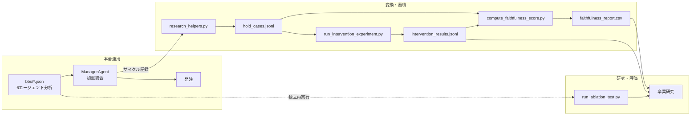

# マルチエージェントAIの判断をBBSで因果トレースする

> 個人開発している米国株スイングトレードAI「ai-investor-bot」で、
> 6エージェントの合議制判断を後から検証可能にした設計と、それが副産物として
> 研究基盤になった経緯について。

## なぜ「ブラックボックスな判断」ではなく「因果を追える判断」が必要か

このシステムは6体のエージェント（Technical/News/Macro/Social/Fundamental/Liquidity）が
それぞれ独立にシグナルを出し、ManagerAgentがそれを加重統合してBUY/HOLDを決める。
実弾が動くシステムなので、「なぜHOLDだったのか」を後から遡れないのは致命的だと考えている。

LLMの合議制は、単体のLLM判断より頑健に見えるが、実は説明責任という点では逆に厄介になりうる。
「6体の意見をまとめてこの結論になりました」で終わってしまうと、どのエージェントが実質的に
結論を決めていたのか、人間には見えない。判断の精度そのものより先に、**判断の因果関係を
後から機械的に検証できること**を優先して設計した。

## BBS方式の設計思想：なぜファイルベースの疎結合にしたか

エージェント間の通信は、関数呼び出しやメッセージキューではなく、セッションごとの
`bbs/{session_id}.json` というJSONファイルに書き込む形にしている。各エージェントは
`{agent, key, timestamp, data}` という形式で自分の分析結果を書き込み、後続のエージェントは
そのファイルを読むだけ。密結合なAPI呼び出しを避けている。

この設計は元々「エージェントの追加・差し替えを楽にする」ための判断だった。しかし今回、
研究用のデータ抽出コード（HOLD判断の原因特定や説明の忠実性評価）を書き足す過程で、
同じ設計がそのまま「後から新しい分析軸を追加しやすい」という性質にもなっていることに
気づいた。実際、抽出コード一式は本番の判断ロジックに一切手を入れずに追加できた。
「エージェントを増やしやすい設計」と「評価軸を増やしやすい設計」が、同じ1つの
アーキテクチャ判断から自然に両立していた——これは設計時には意図していなかった発見である。

## BBSから研究データへ——変換パイプラインの全体像

（全体図は [`docs/diagrams/bbs_research_connection.mmd`](../diagrams/bbs_research_connection.mmd) 参照）

ポイントは3つある。1つ目は、`hold_cases.jsonl → intervention_results.jsonl →
faithfulness_report.csv` が**直列の依存関係**だということ。まずHOLD判断のケースを集積し、
次に各ケースでエージェントを1体ずつ除外・反転させて「本当はどのエージェントが原因だったか」
を特定し、最後にその実測結果とManagerAgentが最初に説明した理由を突き合わせて、説明の
正確性（Faithfulness）を数値化する。3つのファイルは並列の出力ではなく、1本のパイプラインの
中間生成物である。

2つ目は、`run_ablation_test.py`（エージェント除外実験）だけは**蓄積データを一切経由しない**
独立系統だということ。これは`main.py`のトレードサイクルを直接importし、その場でエージェントを
1体除外して再実行する。過去の蓄積データを読むのではなく、常に最新のコードでその場から
再検証する設計にしたのは、蓄積データが古くなることで実験結果が実装の現状とズレる、という
リスクを避けたかったからだ。

3つ目は、この図の矢印が一貫して左から右にしか伸びていないこと。研究側のスクリプトが
本番の判断ロジックを書き換えることは構造上ありえない。研究のための実験が本番の挙動に
影響を与えない、という分離を意図的に保っている。

## 現状の制約——正直に書く

研究としてすでに完成している、という話ではない。現時点の制約は以下の通り。

- `training_data.jsonl`（サイクル全体の入出力ログ）は、コード自体のdocstringに
  「将来のモデル蒸留・ファインチューニングのために」と明記されている通り、まだ実際の
  ファインチューニングには使われていない。蓄積フェーズにある。
- `evaluate_financebench.py`（外部ベンチマークとの比較）はまだ実装されておらず、
  ロードマップ上の未着手項目にとどまっている。
- テストスイートは332件（既知の失敗2件）、Universe拡大バックテストの勝率は46.0%
  （3ヶ月・189取引・100銘柄）という実測値はあるが、これらは主にトレードロジックの
  検証結果であり、「AIのHOLD判断評価フレームワーク」としての研究はまだ体系化の途上、
  自分の中でPhase B（研究・評価強化）と呼んでいる段階にある。

## まとめ

BBSは最初、単なるエージェント間のログでしかなかった。しかしファイルベースの疎結合という
設計判断が、結果的に本番コードを一切変更せずに研究用の抽出パイプラインを積み増せる基盤に
なった。プロダクトのために選んだ設計が、副産物として卒業研究の実験基盤になった、という
順序が実際に起きたことであり、その逆ではない。

次は、この因果トレースの仕組みを使って実際に何を測ろうとしているのか——AIのHOLD判断を
どう評価するかという研究設計そのものについて書きたい。

<!-- 執筆メモ（本人用）:
- 数値は332件・46.0%（189取引/3ヶ月/100銘柄）のみ使用。資産額・実損益は不記載。
- Mermaid図は元図から本番ゾーンを簡略化して抜粋（TradeGuard/CriticAgent/LiveTradingGate等の安全機構はブログ①で扱い済みのため今回は割愛）。全体図は本文中でリンクした .mmd を参照させる形にした。
- 肉付け候補: intervention_results.jsonlのtrue_cause_agents分布（dashboard Section 5の実データ）を具体例として1つ挿入する、hold_cases.jsonlのサンプル件数を明記する。
-->
